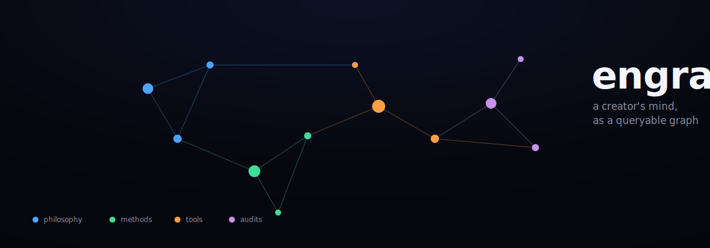

<p align="center">
  
</p>

<h1 align="center">Engram</h1>

<p align="center">
  <b>Turn a creator's entire public output into a queryable, citable knowledge-graph "brain".</b><br>
  One creator → one brain skill: a reasoning graph of atoms + edges, a distilled wiki,
  preserved source transcripts, and an interactive visualization.
</p>

<p align="center">
  
  
  
  
</p>

<p align="center">
  <a href="#quickstart">Quickstart</a> ·
  <a href="#how-a-brain-is-built">How it works</a> ·
  <a href="#the-fidelity-guardrail">Fidelity</a> ·
  <a href="#cli">CLI</a> ·
  <a href="#the-visualization">Visualization</a>
</p>

---

## What it is

Most "summarize this channel" tools collapse hours of content into a tidy paragraph and throw away
~95% of the person. **Engram does the opposite.** It mines a creator's transcripts *window by
window* into thousands of **atoms** — single irreducible facts, each typed and cited — and connects
them with **typed edges** (`because`, `contradicts`, `evidence-for`, …) into a reasoning graph.

The result is a callable **brain**: ask it a question and it answers from the creator's actual
frameworks, with citations back to the exact source video — not a vague gist.

A brain is just a **data directory**. The Python package here is the shared factory tooling; you
never re-author build scripts per brain. Built to plug into [Claude Code](https://claude.com/claude-code)
as a skill, but the graph, audits, and tooling are plain Python and stand on their own.

```
brain/
├── atoms.jsonl        # NODES — one typed, cited fact per line
├── edges.jsonl        # typed reasoning links between atoms
├── graph.html         # interactive visualization (generated)
├── references/        # distilled wiki: knowledge.md + topics/*.md
└── sources/           # ground truth: manifest.json + raw transcripts
```

## The fidelity guardrail

The #1 failure mode of any atomization system: a creator says *"everyone thinks **X**, but that's
wrong"* — and the brain stores a bare atom **"X"**, inverting the meaning. Sarcasm, strawmen, and
debunk videos are where this hides.

Engram defends against it on two fronts:

- An **`attribution`** field on every atom — `creator` (their own voice), `quoted` (a claim they
  report or debunk), or `hypothetical` (a strawman) — plus a `verbatim` anchor on contested claims.
- A **polarity audit** (`python -m engram polarity`) that locates each atom in its source transcript
  and flags any atom sitting next to a negation/attribution cue that lacks a `verbatim` anchor or an
  `attribution` tag. Those are exactly the atoms a careless pass would invert.

```
$ python -m engram polarity examples/demo-brain
POLARITY AUDIT: …/demo-brain
scanned 17 atoms — 0 near a negation/attribution cue without a verbatim anchor or attribution tag
[OK] no unanchored atoms near negation/attribution cues.
```

## Quickstart

**Requirements:** Python 3.10+. For fetching, [`yt-dlp`](https://github.com/yt-dlp/yt-dlp) on PATH
(a JS runtime such as `deno`/`node` and `ffmpeg` are recommended for current YouTube extraction).

```bash
git clone https://github.com/<you>/engram.git
cd engram
pip install -r requirements.txt

# explore the bundled example brain
python -m engram check examples/demo-brain
open  examples/demo-brain/graph.html      # macOS  (use `start` on Windows, `xdg-open` on Linux)
```

Build your own:

```bash
python -m engram new brains/mycreator --creator "Their Name" --channel "https://youtube.com/@handle"
python -m engram fetch "https://youtube.com/@handle" brains/mycreator   # enumerate + transcripts
# …distill transcripts into atoms+edges (see SKILL.md), staging each video, then:
python -m engram add   brains/mycreator stage.json
python -m engram check brains/mycreator                                  # build + audit + polarity
python -m engram topics brains/mycreator
```

With Claude Code, the whole distillation is automated — drop the repo in `~/.claude/skills/engram`
and say *"build a brain from this channel"*. The factory workflow lives in [`SKILL.md`](SKILL.md).

## How a brain is built

| Step | Command | What it does |
|------|---------|--------------|
| **Enumerate + fetch** | `engram fetch <url> <dir>` | Lists every video + the `/shorts` tab, pulls captions, writes transcripts + `manifest.json`. Incremental — re-run to add only new uploads. |
| **Distill** | *(model, per `SKILL.md`)* | Mine each transcript window-by-window into ~1 atom / 18–25 words; connect with typed edges. |
| **Add** | `engram add <dir> stage.json` | Append a staged batch, guarded: aborts on id collisions, bad types/rels, or unresolved edges. |
| **Gate** | `engram check <dir>` | Integrity + per-source density gate + coverage + polarity, and regenerates `graph.html`. Exits non-zero until green. |
| **Index** | `engram topics <dir>` | Regenerates `references/topics/*.md` from the atom store (the store is the single source of truth). |

Builds are **resumable**: state lives in the brain itself (`manifest.json` lists all videos,
`atoms.jsonl` records which are done), so a re-run continues where it left off.

## CLI

```
python -m engram new <dir>                 scaffold a new empty brain
python -m engram fetch <channel> <dir>     enumerate a channel + fetch transcripts (incremental)
python -m engram add <dir> <stage.json>    append a staged batch of atoms + edges (guarded)
python -m engram build <dir>               validate + density gate + regenerate graph.html
python -m engram audit <dir>               coverage audit (words-per-atom density)
python -m engram polarity <dir> [--strict] fidelity audit (negation / attribution)
python -m engram topics <dir>              regenerate references/topics/*.md
python -m engram graph <dir>               regenerate graph.html only
python -m engram check <dir>               build + audit + polarity in one pass (CI-friendly)
```

## The visualization

`graph.html` is a single self-contained file — no build step, no dependencies, no network. It runs
a live force-directed ("jelly") simulation on a canvas, warm-started from a layout computed in
Python, and layers a glass UI on top:

- **Topic clusters**, colour-coded, with a click-to-isolate legend
- **Search** that highlights matching atoms (`/` to focus)
- **Click any node** for a detail panel: type, confidence, attribution, source link, and every
  connected atom with its relationship — click a neighbour to walk the graph
- Drag nodes, scroll/pinch to zoom, `F` to refit — responsive down to mobile, with loading and
  empty states

## Anatomy of an atom

```json
{"id": "fo7", "type": "concept", "topic": "focus", "confidence": "CORE",
 "sources": ["ada-focus"], "attribution": "creator",
 "text": "Focus is a budget, not a feeling: you spend it on the work or on the meta-work.",
 "verbatim": "Focus is a budget, not a feeling", "tags": ["attention"]}
```

`type` ∈ claim · concept · definition · number · result · example · analogy · method · caveat ·
idea · product · opinion · warning · prediction · bio · resource · style.
Edge `rel` ∈ because · defines · part-of · example-of · analogy-for · evidence-for · qualifies ·
contrast · contradicts · leads-to · enables · depends-on · generalizes · uses · method-for ·
supports · about · enabled-by.

## Development

```bash
pip install -r requirements-dev.txt
pytest -q
```

## Limitations

- A brain is **distilled public teaching**, current only as of its manifest's fetch date — not
  validated fact, not advice. Confidence and attribution tags exist so you can weight accordingly.
- The polarity audit is a heuristic safety net, not a proof — it catches the common inversion
  pattern; careful attribution at distill time is still the real defense.
- Fetching depends on captions being available; videos without captions are listed as `missed`.

## License

[MIT](LICENSE) © contributors. The bundled `examples/demo-brain` uses a fictional creator and
invented transcripts — no real person or copyrighted material.
